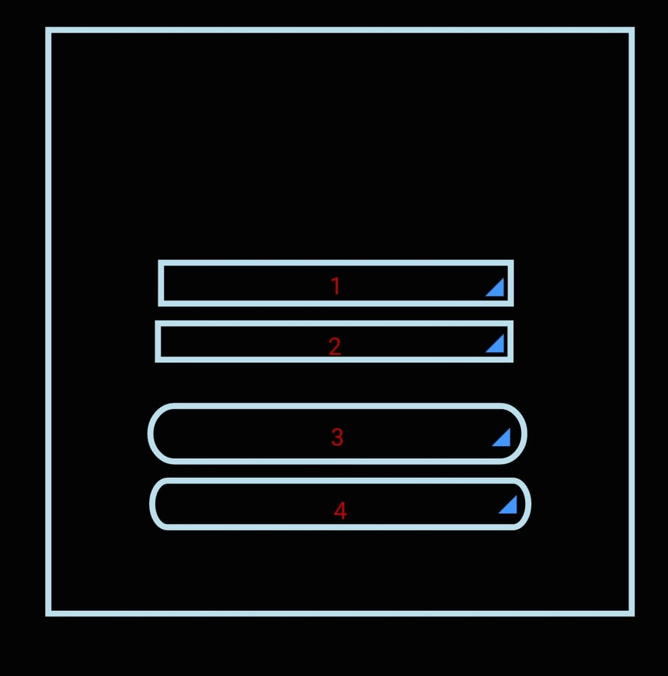
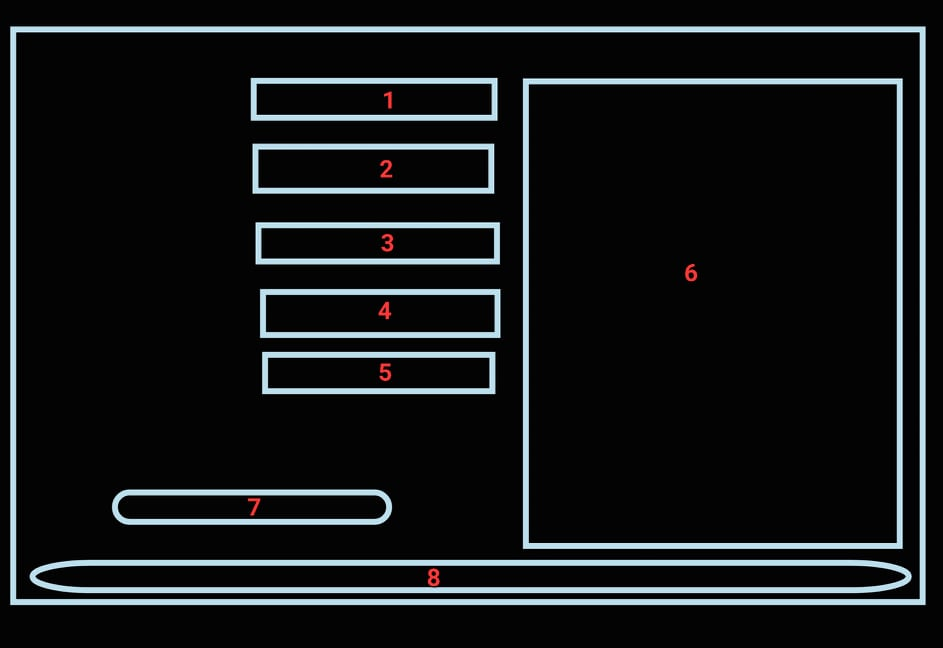

# Rendszertev

## A rendszer célja

A rendszerünk egy egyszerű folyamatleíró resndszer, amelyben különböző számítógépeket tudunk előállítani.

## Projektterv

Ketten dolgozunk a rendszeren:
- Krigovszki Bálint
- Sazbó Gergely Gyula

## Üzleti folyamatok modellje

A felhasználó bejelentkezés után be tudja vinni az adatokat, melyek alapján a rendszerünk különböző számítógépeket készít. Továbbá visszajelzést kap a felhasználó, hogy milyen gépeket készített már el korábban a rendszer.

## Követelmények

- be és kijelentkezés megvalósítása
- erőforrás beállításának lehetősége
- készítés indítása
- elkészült eszközök megjelenítése (listában)

## Funkcionális terv

1: email cím megadása
2: jelszó megadása
3: bejelentkezés gomb
4: rendszerből való kilépés

1: típus kiválasztása (pc, laptop, telefon, tablet)
2: processzor kiválasztása (legördülű listából)
3: ram mennyiségének beállítása (megdjató GB-ban)
4: tárhely mennyiségének kiválasztása (megadható GB-ban)
5: videókártya kiválasztása (nem kötelező, legördülő menü)
6: kész elemek listázása
7: készítés indítása
8: kilépés

## Fizikai környezet

Az alakalmazást Java-ban fejlesztjük, adatbázishoz mysql lesz használva.

## Adatbázis terv

2 táblát veszünk igénybe:
- users: a belépés adatait tároljuk itt
- computers: az elkészített eszközök listája

## Implementációs terv

Két tervezési mintát fogunk használni az alkalmazás fejlesztéséhez:
- Abstract Factory
- Decorator

